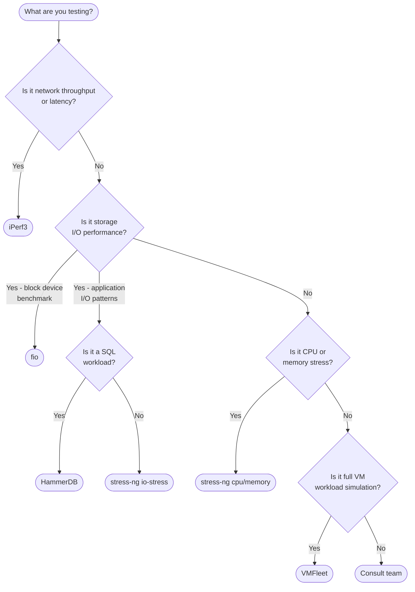

# Tool Selection Guide

Use this guide to select the right tool for your Azure Local performance validation scenario. The decision flowchart covers the most common questions; the comparison table below it covers all dimensions.

---

## Decision Flowchart

---

## Tool Comparison Matrix

| Dimension | fio | iPerf3 | HammerDB | stress-ng | VMFleet |
|-----------|-----|--------|----------|-----------|---------|
| **Primary purpose** | Block device I/O benchmarking | Network throughput & latency | SQL database benchmarking | OS-level stress (CPU/memory/I/O) | Full VM workload simulation |
| **Target OS** | Linux | Linux / Windows | Windows | Linux | Windows (HCI host) |
| **Protocol** | POSIX file I/O | TCP / UDP | TDS (SQL Server), libpq (PostgreSQL) | POSIX / kernel syscalls | Hyper-V VM workload |
| **Output format** | JSON | JSON | HammerDB log + parsed JSON | YAML + parsed JSON | CSV / JSON |
| **Profile count** | 5 | 3 | 2 | 3 | N/A (config-driven) |
| **Install method** | Ansible (`Install-Fio.ps1`) | `apt` / `dnf` | PowerShell remoting (`Install-HammerDB.ps1`) | `apt` / `dnf` | `Install-VMFleet.ps1` |
| **CI/CD ready** | Yes | Yes | Yes | Yes | Yes |
| **Monitoring alerts** | 7 rules | 6 rules | 7 rules | 6 rules | (shared PerfMon) |
| **Key metric** | IOPS, throughput MB/s, latency P99 | Throughput MB/s, jitter ms | NOPM, TPM | bogo-ops/sec | VM IOPS, CPU% |
| **Parallelises across nodes** | Yes (all nodes simultaneously) | Yes (pairs / mesh) | Yes (per-node DB instance) | Yes (all nodes simultaneously) | Yes (VM fleet distributes load) |

---

## Scenario Examples

### "We want to know if our RDMA storage network is healthy after hardware replacement."

**→ Use iPerf3 (mesh profile)**

Mesh throughput between all node pairs will expose any link degraded from 10GbE to 1GbE, misconfigured MTU, or failed SFP.

### "We need to validate that our NVMe SSDs meet the IOPS requirement for a new VM workload."

**→ Use fio (random-read + random-write profiles)**

fio directly benchmarks the block device from inside a VM, giving you raw IOPS and P99 latency that you can compare directly against the SSD datasheet and SLA requirement.

### "We're deploying SQL Server on Azure Local and want to verify it can handle our TPC-C equivalent load."

**→ Use HammerDB (tpc-c profile)**

HammerDB simulates OLTP database operations and reports NOPM (New Orders Per Minute), the standard TPC-C throughput metric.

### "We want to confirm that our AX nodes can sustain CPU load for 5 minutes without thermal throttling."

**→ Use stress-ng (cpu-stress profile)**

Saturates all logical CPUs and reports bogo-ops/sec; the `stressng_cpu_throttling` alert fires if frequency drops below 80%.

### "We want to understand how many VMs our cluster can host before storage IOPS degrades."

**→ Use VMFleet**

VMFleet deploys a configurable fleet of VMs with CDB workload simulation and measures cluster-wide storage throughput as VM density increases.

---

## Combining Tools

For production validation, run tools in sequence:

1. **iPerf3 mesh** — Confirm network fabric health before any other testing
2. **stress-ng cpu-stress** — Verify thermal and BIOS power profile settings
3. **fio sequential + random** — Baseline storage performance per node
4. **HammerDB tpc-c** — Validate SQL workload under realistic OLTP load
5. **VMFleet** — Full-system capacity proving

Each tool writes results to its own `logs\<tool>\<RunId>\` directory; reports can be generated independently after each phase completes.
