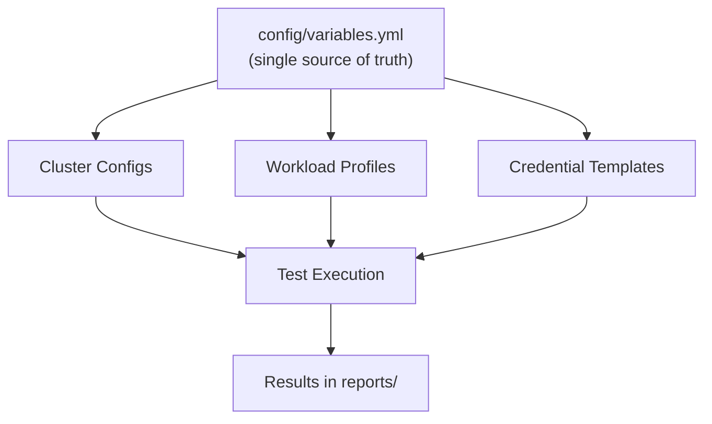

# Automation Interoperability

> **Canonical reference:** [Scripting Framework (full)](https://azurelocal.cloud/standards/scripting/scripting-framework)  
> **Applies to:** All AzureLocal repositories  
> **Last Updated:** 2026-03-17

---

## Overview

This standard defines how automation tools interoperate within the Load Testing Framework. All tools share a single configuration source and follow consistent patterns for execution, logging, and error handling.

---

## Config Flow

---

## Tool Integration Matrix

| Tool | Storage Tests | Network Tests | Compute Tests | Database Tests |
|------|:---:|:---:|:---:|:---:|
| **VMFleet** | ✅ | — | — | — |
| **fio** | ✅ | — | — | — |
| **iPerf3** | — | ✅ | — | — |
| **HammerDB** | — | — | — | ✅ |
| **stress-ng** | — | — | ✅ | — |

---

## Interoperability Rules

1. **Single source of truth** — `config/variables.yml` is the base config; tool-specific configs are in subdirectories.
2. **Consistent execution** — All tools launched via `Invoke-` wrapper scripts.
3. **Idempotency** — All scripts must be safe to re-run.
4. **Error handling** — Every tool must validate config before executing tests.
5. **Logging** — All operations logged to `./logs/` with consistent format.
6. **Results** — All test results stored in `reports/` with timestamped output.

---

## Variable Path Contract

Scripts must use variable paths that exist in the schema. See the [Variable Standards](variables.md) for naming rules and the [Variable Reference](../reference/variables.md) for the complete catalog.

---

## Related Standards

- [Scripting Standards](scripting.md)
- [Infrastructure Standards](infrastructure.md)
- [Solution Standards](solutions.md)
- [Variable Standards](variables.md)
