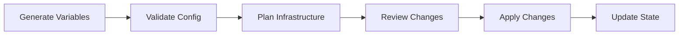
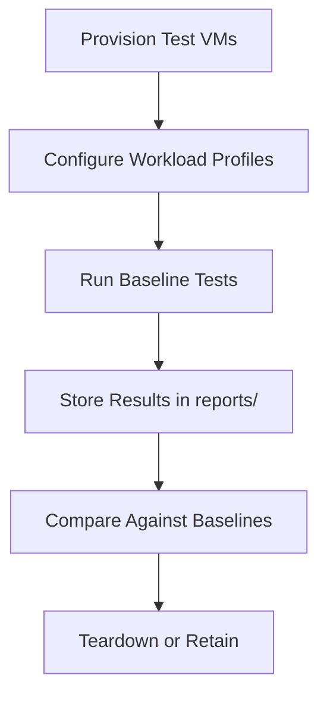

# Infrastructure Standards

> **Canonical reference:** [Infrastructure Standards (full)](https://azurelocal.cloud/standards/infrastructure/)  
> **Applies to:** All AzureLocal repositories  
> **Last Updated:** 2026-03-17

---

## Overview

Standards for Infrastructure as Code (IaC), state management, and deployment processes for the Load Testing Framework.

---

## Infrastructure Pipeline

---

## State Management

| Principle | Rule |
|-----------|------|
| Remote state | Store Terraform state in Azure Storage Account |
| State locking | Enable locking during all operations |
| Backup | Regular state file backups before destructive operations |
| Naming | `loadtools-<env>.tfstate` (e.g., `loadtools-prod.tfstate`) |

---

## LoadTools-Specific Infrastructure

| Convention | Rule |
|-----------|------|
| Primary tooling | PowerShell scripts with config-driven execution |
| Config source | `config/variables.yml` with `clusters/`, `credentials/`, `profiles/` subdirectories |
| VM provisioning | VMFleet VMs provisioned via PowerShell or Hyper-V cmdlets |
| Network validation | iPerf3 tests validate network throughput before storage tests |

### Test Infrastructure Lifecycle

---

## Related Standards

- [Infrastructure Generation & Deployment Process](https://azurelocal.cloud/standards/infrastructure/infrastructure-generation-deployment-process)
- [State Management](https://azurelocal.cloud/standards/infrastructure/state-management)
- [Solution Development Standard](solutions.md)
- [Variable Standards](variables.md)
- [Automation Interoperability](automation.md)
