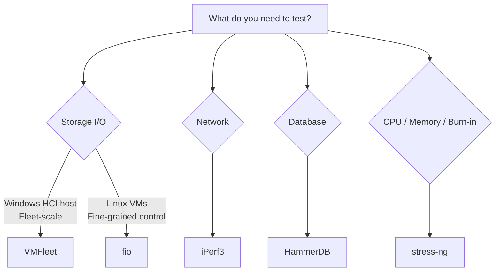

# Load Testing Tools


The Azure Local Load Testing Framework includes five standalone load testing tools. Each tool targets a specific performance domain — storage, network, database, or system stress — and can be run independently from a management workstation with no CI/CD pipeline required.

## Choosing a Tool



## Tool Summary

| Tool | What It Tests | Target OS | Run From | Status |
|------|--------------|-----------|----------|--------|
| [VMFleet](vmfleet/index.md) | Storage IOPS, throughput, latency via DiskSpd VM fleet | Windows (HCI host) | PowerShell | :white_check_mark: Fully Implemented |
| [fio](fio/index.md) | Storage I/O with fine-grained control (block size, queue depth, I/O engine) | Linux VMs | PowerShell + Ansible | :construction: Structure Ready |
| [iPerf3](iperf/index.md) | Network bandwidth, jitter, packet loss between nodes | Linux / Windows | PowerShell | :construction: Structure Ready |
| [HammerDB](hammerdb/index.md) | SQL Server OLTP (TPC-C) and OLAP (TPC-H) benchmarking | Windows VMs | PowerShell | :construction: Structure Ready |
| [stress-ng](stress-ng/index.md) | CPU, memory, cache, and I/O stress for burn-in and capacity planning | Linux VMs | PowerShell + Ansible | :construction: Structure Ready |

## Running a Test (Standalone)

Every tool follows the same three-step pattern. No pipeline or CI/CD setup is needed — just a PowerShell terminal on your management workstation.

### Step 1 — Install the tool on target nodes

```powershell
.\tools\<tool>\scripts\Install-<Tool>.ps1 `
    -ClusterName "hci01.corp.infiniteimprobability.com" `
    -Nodes @("hci01-node1", "hci01-node2")
```

### Step 2 — Run a test with a workload profile

```powershell
.\tools\<tool>\scripts\Start-<Tool>Test.ps1 `
    -ClusterName "hci01.corp.infiniteimprobability.com" `
    -Nodes @("hci01-node1", "hci01-node2") `
    -Profile "general"
```

### Step 3 — Collect results

```powershell
.\tools\<tool>\scripts\Collect-<Tool>Results.ps1 `
    -ClusterName "hci01.corp.infiniteimprobability.com" `
    -Nodes @("hci01-node1", "hci01-node2") `
    -RunId "<run-id-from-previous-step>"
```

Each tool page below has the exact commands with real parameters.

## Common Lifecycle

All tools share the same eight-phase lifecycle. When running standalone, you execute each phase manually. The [CI/CD pipelines](../operations/ci-cd.md) automate this same sequence if you want to schedule or trigger runs automatically.

| Phase | What Happens | Manual Command |
|-------|-------------|----------------|
| Pre-Check | Validate cluster connectivity and prerequisites | `Initialize-Environment.ps1` |
| Install | Deploy tool binaries to target nodes | `Install-<Tool>.ps1` |
| Deploy | Configure test environment (VMs, volumes, etc.) | `Deploy-<Tool>.ps1` (VMFleet only) |
| Test | Execute workload profile | `Start-<Tool>Test.ps1` |
| Monitor | Collect PerfMon / Azure Monitor metrics (parallel) | `Watch-<Tool>Monitor.ps1` |
| Collect | Parse and aggregate raw results | `Collect-<Tool>Results.ps1` |
| Report | Generate PDF / DOCX / XLSX | `New-TestReport` (ReportGenerator module) |
| Cleanup | Remove test artefacts (optional) | `Remove-<Tool>.ps1` |

## Automation (Optional)

If you want to automate test runs on a schedule or as part of a CI/CD workflow, see [CI/CD Pipelines](../operations/ci-cd.md). The pipelines call the same scripts listed above — they are not a separate system.

## Diagrams

Architecture and workflow diagrams are maintained as draw.io files in [`docs/assets/diagrams/`](../assets/diagrams/) and exported as PNG images to [`docs/assets/images/`](../assets/images/) for documentation use.

| Diagram | Source | Description |
|---------|--------|-------------|
| Solution Architecture | `solution-architecture.drawio` | End-to-end framework overview |
| VMFleet Workflow | `vmfleet-workflow.drawio` | VMFleet pipeline phases |
| Config Flow | `config-flow.drawio` | YAML → JSON configuration pipeline |
| CI/CD Pipeline | `ci-cd-pipeline.drawio` | GitHub Actions / Azure DevOps flow |
| Network Topology | `network-topology.drawio` | Cluster network paths for testing |

!!! info "Exporting Diagrams"
    To export updated PNGs from draw.io source files, the MkDocs `drawio` plugin handles this automatically during site builds. You can also export manually from draw.io desktop or VS Code extension.
