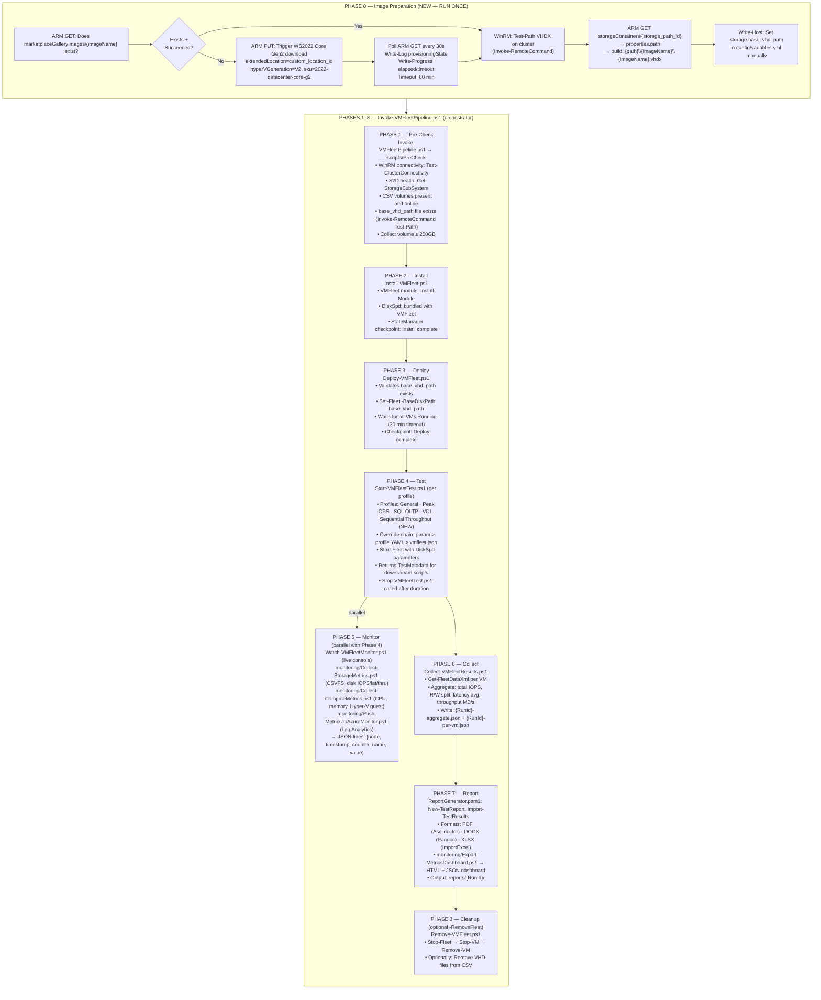

# Plan: VMFleet — Full End-to-End Implementation

**TL;DR**: VMFleet has a solid 9-phase scaffolded pipeline. The **critical blocker** is `base_vhd_path` — the cluster has no base VHDX and no script to get one. This plan covers: (1) unblocking the pipeline with `Prepare-VMFleetBaseImage.ps1`, (2) a missing sequential-throughput workload profile, (3) all documentation gaps across `docs/tools/vmfleet/`, and (4) ensuring full automation standards compliance across every script. Every item below maps to a specific file with a specific change.

---

## Epic Tracking — Issue #5

**Epic**: [Dev tracker: Load and performance testing toolkit](https://github.com/AzureLocal/azurelocal-loadtools/issues/5)
**Author**: @kristopherjturner

This plan implements **VMFleet** as the first fully-delivered tool integration, plus the core framework modules, monitoring, reporting, and profile configuration that all other tools (`fio`, `HammerDB`, `iPerf`, `stress-ng`) will reuse. The following checklist items from the epic are addressed by this plan:

### Epic Checklist — Items Addressed Here

| Status | Epic Item | This Plan |
|---|---|---|
| ✅ Done | Repository structure and standards | — already complete |
| ✅ Done | MkDocs Material documentation site deployed | — already complete |
| ✅ Done | CI/CD with GitHub Actions | — already complete |
| ✅ Done | Vale linting integrated | — already complete |
| ✅ Done | Documentation migrated from AsciiDoc to Markdown | — already complete |
| ✅ Done | Draw.io diagrams preserved in `assets/diagrams/` | — already complete |
| 🔲 **Open** | **Core framework — `src/core/` modules** | ⚠️ Modules exist (Logger, ConfigManager, StateManager, CredentialManager, MonitoringManager, ReportGenerator) — verify all are fully implemented before claiming closed |
| 🔲 **Open** | **Infrastructure provisioning — VM deployment for load testing** | ✅ **This plan** → `src/infrastructure/Prepare-VMFleetBaseImage.ps1` |
| 🔲 **Open** | **Tool integrations — VMFleet (storage fleet testing)** | ✅ **This plan** → all 8 pipeline phases via `Invoke-VMFleetPipeline.ps1` + all scripts |
| 🔲 Open | Tool integrations — FIO | ❌ Out of scope for this plan — placeholder only |
| 🔲 Open | Tool integrations — HammerDB | ❌ Out of scope for this plan — placeholder only |
| 🔲 Open | Tool integrations — iPerf | ❌ Out of scope for this plan — placeholder only |
| 🔲 Open | Tool integrations — stress-ng | ❌ Out of scope for this plan — placeholder only |
| 🔲 **Open** | **Monitoring collectors and dashboards** | ✅ **This plan** → collection pipeline exists; `vmfleet-workbook.json` + KQL queries added |
| 🔲 **Open** | **Report generation from test results** | ✅ **This plan** → `ReportGenerator.psm1` + `Export-MetricsDashboard.ps1` (PDF/DOCX/XLSX/HTML) |
| 🔲 **Open** | **Profile-based test configurations** | ✅ **This plan** → 4 existing profiles + `sequential-throughput.yml` (new) |
| 🔲 **Open** | **Credential management** | ✅ **This plan** → `CredentialManager.psm1` used in all scripts (Key Vault → interactive fallback) |
| 🔲 Open | Pipeline integration examples | ❌ Out of scope for this plan |
| 🔲 Open | Alerting thresholds and rules | ❌ Out of scope (future: defined in profile `expected_thresholds`) |
| 🔲 **Open** | **Documentation — tool-specific guides** | ✅ **This plan** → all 6 `docs/tools/vmfleet/*.md` files updated |
| 🔲 Open | Documentation — operations runbooks | ❌ Out of scope for this plan |

### Items This Plan Does NOT Close

The following epic items are explicitly out of scope and will require separate planning:

- `fio`, `HammerDB`, `iPerf`, `stress-ng` tool integrations
- Pipeline integration examples (GitHub Actions / Azure DevOps YAML)
- Alerting thresholds and rules (separate from profile `expected_thresholds`)
- Operations runbooks

---

## Pipeline Flowchart — Full End-to-End



---

## Automation Standards Compliance Checklist

Every script in the pipeline (existing and new) must satisfy all rows below. The `Prepare-VMFleetBaseImage.ps1` must be built to match. Existing scripts already meet these standards — the checklist is the gate for new work.

| Rule | Standard | Source | Status |
|---|---|---|---|
| `#Requires -Version 7.2` | All scripts | `docs/standards/scripting.md` | ✅ All existing / must add to new |
| `[CmdletBinding(SupportsShouldProcess)]` | All scripts | scripting.md | ✅ All existing / must add to new |
| `$ErrorActionPreference = 'Stop'` | All scripts | scripting.md | ✅ All existing / must add to new |
| Dot-source `Common-Functions.ps1` | All scripts | architecture | ✅ All existing / must add to new |
| Import `Logger.psm1` | All scripts | Logger module | ✅ All existing / must add to new |
| `Start-LogSession` in body (before try) | All scripts | Logger | ✅ All existing / must add to new |
| `Stop-LogSession` in `finally` block | All scripts | Logger | ✅ All existing / must add to new |
| `Write-Log -Severity Information/Warning/Error` | All significant actions | Logger | ✅ All existing / must add to new |
| Full `try/catch/finally` | All scripts | scripting.md | ✅ All existing / must add to new |
| Config-driven — no hardcoded values | All scripts | scripting.md automation.md | ✅ All existing / must add to new |
| Three-level override chain (param > JSON > default) | All scripts | configuration doc | ✅ All existing / must add to new |
| `-ConfigPath` / `-ClusterConfigPath` / `-ProjectRoot` parameters | All config-driven scripts | scripting.md Invoke- standard | ✅ All existing / must add to new |
| `-Credential [PSCredential]` parameter with Key Vault fallback | All scripts | scripting.md | ✅ All existing / must add to new |
| `-WhatIf` via `SupportsShouldProcess` — dry-run safe | All scripts | scripting.md | ✅ All existing / must add to new |
| `Invoke-RemoteCommand` for all WinRM operations | All cluster-touching scripts | `Common-Functions.ps1` | ✅ All existing / must add to new |
| `Test-ClusterConnectivity` before any remote action | All cluster-touching scripts | `Common-Functions.ps1` | ✅ All existing / must add to new |
| IIC naming in all placeholder/example values | Config files, doc examples | `docs/standards/examples.md` | ⚠️ Verify in new config fields |
| `snake_case` for all YAML config keys | Config files | `docs/standards/variables.md` | ✅ Maintain for new fields |
| Idempotent — safe to re-run | All scripts | automation.md | Must design into new script |
| Logs to `logs/vmfleet/<timestamp>.log` | All VMFleet scripts | scripting.md Logger | ✅ via Logger |
| `StateManager` checkpoint tracking | Orchestrator phases | StateManager module | ✅ in orchestrator — not needed in infra script |
| Script naming: `Verb-Noun.ps1` | All scripts | scripting.md | ✅ `Prepare-VMFleetBaseImage.ps1` ✅ |

---

## Phase 0: Base Image Preparation — `Prepare-VMFleetBaseImage.ps1` *(BLOCKER — must land before Phase 1 can succeed)*

### What it does

| Step | Action | ARM/WinRM |
|---|---|---|
| 1 | `Test-ClusterConnectivity` on all nodes | WinRM |
| 2 | ARM GET `marketplaceGalleryImages/{imageName}` — exists + Succeeded + not `-Force`? → skip to step 5 | ARM |
| 3 | ARM PUT — trigger WS2022 Core Gen2 download | ARM |
| 4 | Poll ARM GET every `$PollIntervalSeconds` (default 30s), log `provisioningState`, `Write-Progress`, throw on `$TimeoutMinutes` (default 60 min) | ARM |
| 5 | ARM GET `{storage_path_id}?api-version=2023-09-01-preview` → `properties.path` → build `{path}\{imageName}\{imageName}.vhdx` | ARM |
| 6 | `Invoke-RemoteCommand` on primary node → `Test-Path {resolvedVhdxPath}` | WinRM |
| 7 | `Write-Host` resolved path — user sets `storage.base_vhd_path` in `variables.yml` manually | Console |

### ARM PUT body shape

```json
PUT /subscriptions/{sub}/resourceGroups/{rg}/providers/
    Microsoft.AzureStackHCI/marketplaceGalleryImages/{imageName}
    ?api-version=2023-09-01-preview

Body:
  location: {azure.location}
  extendedLocation:
    type: CustomLocation
    name: {azure_local.custom_location_id}
  properties:
    osType: Windows
    hyperVGeneration: V2
    identifier:
      publisher: MicrosoftWindowsServer
      offer: WindowsServer
      sku: 2022-datacenter-core-g2
    version:
      name: latest
```

### Script parameters

| Parameter | Type | Default | Purpose |
|---|---|---|---|
| `-ConfigPath` | string | auto | `variables.yml` |
| `-ClusterConfigPath` | string | auto | cluster YAML |
| `-ProjectRoot` | string | auto | repo root |
| `-Credential` | PSCredential | null | Key Vault → prompt fallback |
| `-ImageName` | string | `ws2022-core-g2` | gallery image resource name |
| `-PollIntervalSeconds` | int | 30 | ARM poll frequency |
| `-TimeoutMinutes` | int | 60 | download wait cap |
| `-Force` | switch | — | re-trigger even if Succeeded |

### Files changed

- `src/infrastructure/Prepare-VMFleetBaseImage.ps1` — **NEW**
- `config/variables.example.yml` — add `custom_location_id` + `storage_path_id` under `azure_local:`
- `config/schema/variables.schema.json` — add both fields under `azure_local.properties` and `azure_local.required`

---

## Phase 4: Workload Profiles — Types of Tests

### Existing profiles (no changes needed)

| Profile | Block | Write% | Random% | OIO | Threads/VM | Use Case |
|---|---|---|---|---|---|---|
| `general.yml` | 8K | 30 | 70 | 8 | 2 | Baseline mixed workload |
| `peak-iops.yml` | 4K | 0 | 100 | 32 | 4 | Maximum IOPS ceiling |
| `sql-oltp.yml` | 8K | 40 | 100 | 16 | 4 | SQL Server OLTP simulation |
| `vdi.yml` | 8K | 20 | 80 | 4 | 1 | Virtual Desktop Infrastructure |

### New profile — `sequential-throughput.yml` *(must be created)*

Large sequential writes at 512K block size. Standard test for measuring maximum storage controller throughput (MB/s ceiling), not IOPS. Without this, there is no throughput test — only IOPS tests.

```yaml
# =============================================================================
# VMFleet Workload Profile: Sequential Throughput
# =============================================================================
# Large-block sequential writes for maximum throughput (MB/s) measurement.
# Tests the raw bandwidth ceiling of Storage Spaces Direct.
# =============================================================================

profile:
  name: "Sequential Throughput"
  description: "512K sequential writes for maximum storage throughput measurement"
  category: "throughput"
  parameters:
    block_size: "512k"
    write_ratio: 100
    random_ratio: 0
    outstanding_io: 32
    threads_per_vm: 2
    duration_seconds: 300
    warmup_seconds: 60
  expected_thresholds:
    min_iops_per_node: 500
    max_latency_ms: 50
    min_throughput_mbps: 2000
```

**File**: `config/profiles/vmfleet/sequential-throughput.yml` — **NEW**

---

## Phase 5: Monitoring & Dashboards

### What exists

| Script | What it collects | Output format |
|---|---|---|
| `monitoring/Collect-StorageMetrics.ps1` | PerfMon: CSVFS read/write IOPS, bytes/sec, latency; physical disk counters | JSON-lines: `{node, timestamp, counter_name, value}` |
| `monitoring/Collect-ComputeMetrics.ps1` | PerfMon: CPU%, memory, Hyper-V guest counters per node | JSON-lines same format |
| `monitoring/Push-MetricsToAzureMonitor.ps1` | Reads JSONL → Log Analytics Data Collector API | Log Analytics workspace |
| `monitoring/Export-MetricsDashboard.ps1` | Reads JSONL → HTML dashboard + JSON summary | `reports/{RunId}/dashboard.html` |
| `Watch-VMFleetMonitor.ps1` | Live console: real-time `Get-FleetDataXml` aggregates | Console (optionally log file) |

### What is missing

| Gap | Description | File |
|---|---|---|
| Azure Monitor Workbook definition | JSON workbook to visualize Log Analytics data in Azure portal | `monitoring/workbooks/vmfleet-workbook.json` — **NEW** |
| Kusto queries | KQL for IOPS, latency, throughput trends in Log Analytics | `monitoring/queries/vmfleet-iops.kql`, `vmfleet-latency.kql` — **NEW** |
| Counter reference docs | `monitoring.md` needs richer counter table + KQL examples | `docs/tools/vmfleet/monitoring.md` — **UPDATE** |

---

## Documentation Plan — `docs/tools/vmfleet/`

All 6 VMFleet docs exist. Here is what each needs:

### `docs/tools/vmfleet/prerequisites.md` — UPDATE

- Fix "Windows Server 2019+" → "Windows Server 2022 Datacenter Core Gen2"
- Add row to Cluster Storage Requirements: "Azure Subscription + Custom Location ID + Storage Path ID (for marketplace image download)"
- Add new section: **Base Image Preparation** — explains `Prepare-VMFleetBaseImage.ps1`, what it does, how to run it, and "set `storage.base_vhd_path` with the output path before running Deploy"
- Add two new rows to Software Requirements: "Azure PowerShell (`Az.Accounts`) — for marketplace download" and "WinRM authentication to cluster nodes"

### `docs/tools/vmfleet/deployment.md` — UPDATE

- Add Phase 0 section at the top: "Image Preparation" — step-by-step `Prepare-VMFleetBaseImage.ps1` example with IIC placeholder values
- Add "First-Time vs Subsequent Runs" note — phase 0 is run-once, phases 1–8 repeat per test cycle
- Ensure IIC naming in all example commands

### `docs/tools/vmfleet/workload-profiles.md` — UPDATE

- Add `Sequential Throughput` profile documentation (new profile)
- Add a DiskSpd parameter mapping table: how profile YAML fields map to `diskspd.exe` flags (`-b`, `-w`, `-r`, `-o`, `-t`, `-d`, `-W`)
- Add "Running a Profile" section with explicit PowerShell example for each profile:

  ```powershell
  # Example: SQL OLTP
  .\src\solutions\vmfleet\scripts\Start-VMFleetTest.ps1 `
      -ProfilePath "config/profiles/vmfleet/sql-oltp.yml" `
      -ClusterConfigPath "config/clusters/iic-cluster.yml"
  ```

- Add "Expected Thresholds" table per profile to set pass/fail expectations
- Add "Profile Selection Guide" — which profile to use for which workload type

### `docs/tools/vmfleet/monitoring.md` — UPDATE

- Add console monitoring quick start: `Watch-VMFleetMonitor.ps1` with example and annotated output
- Add Azure Monitor integration section: what `push_to_azure_monitor: true` in `vmfleet.json` does, what fields land in Log Analytics
- Add KQL query examples for IOPS trends, latency p95, throughput over time
- Add "Dashboard Export" section: how to run `Export-MetricsDashboard.ps1`, where `dashboard.html` lands, what it shows
- Add "Counter Reference" table: every PerfMon counter collected and what it means

### `docs/tools/vmfleet/reporting.md` — UPDATE

- Add "Output files" table: `{RunId}-aggregate.json`, `{RunId}-per-vm.json`, `dashboard.html`, PDF, DOCX, XLSX — what each contains
- Add example aggregate JSON snippet to show output shape
- Add "Report Contents" section: what's in the PDF vs DOCX vs XLSX

### `docs/tools/vmfleet/troubleshooting.md` — UPDATE

- Add entry: "Base VHD not found" → run `Prepare-VMFleetBaseImage.ps1` first
- Add: "ARM PUT for marketplace image returns 400" → check `custom_location_id` is the correct custom location ARM ID format
- Add: "provisioningState stuck at Downloading" → normal, can take 30–90 min depending on image size and cluster bandwidth

### `docs/getting-started/prerequisites.md` — UPDATE

- Add row to Azure Requirements table: "Azure Local Arc integration — `custom_location_id` required for marketplace image download"
- Add note that `custom_location_id` and `storage_path_id` are required in `config/variables.yml` under `azure_local:`

---

## Implementation Order with Dependencies

```
Step 1A  config/variables.example.yml              add custom_location_id, storage_path_id      (no deps)
Step 1B  config/schema/variables.schema.json       add both fields                              (parallel with 1A)
Step 2   src/infrastructure/Prepare-VMFleetBaseImage.ps1   new script                          (after 1A)
Step 3   config/profiles/vmfleet/sequential-throughput.yml new profile                         (no deps, parallel with 1A/1B)
Step 4A  docs/tools/vmfleet/prerequisites.md       update                                       (after Step 2)
Step 4B  docs/tools/vmfleet/deployment.md          update                                       (after Step 2)
Step 4C  docs/tools/vmfleet/workload-profiles.md   update                                       (after Step 3)
Step 4D  docs/tools/vmfleet/monitoring.md          update                                       (no deps)
Step 4E  docs/tools/vmfleet/reporting.md           update                                       (no deps)
Step 4F  docs/tools/vmfleet/troubleshooting.md     update                                       (after Step 2)
Step 4G  docs/getting-started/prerequisites.md     update                                       (after Step 2)
```

---

## Relevant Files — Complete List

### New files

- `src/infrastructure/Prepare-VMFleetBaseImage.ps1`
- `config/profiles/vmfleet/sequential-throughput.yml`
- `monitoring/workbooks/vmfleet-workbook.json` *(lower priority)*
- `monitoring/queries/vmfleet-iops.kql` *(lower priority)*
- `monitoring/queries/vmfleet-latency.kql` *(lower priority)*

### Config updates

- `config/variables.example.yml`
- `config/schema/variables.schema.json`

### Doc updates

- `docs/tools/vmfleet/prerequisites.md`
- `docs/tools/vmfleet/deployment.md`
- `docs/tools/vmfleet/workload-profiles.md`
- `docs/tools/vmfleet/monitoring.md`
- `docs/tools/vmfleet/reporting.md`
- `docs/tools/vmfleet/troubleshooting.md`
- `docs/getting-started/prerequisites.md`

### Unchanged (fully implemented and standards-compliant — no changes)

- `src/solutions/vmfleet/Invoke-VMFleetPipeline.ps1`
- `src/solutions/vmfleet/scripts/Install-VMFleet.ps1`
- `src/solutions/vmfleet/scripts/Deploy-VMFleet.ps1`
- `src/solutions/vmfleet/scripts/Start-VMFleetTest.ps1`
- `src/solutions/vmfleet/scripts/Stop-VMFleetTest.ps1`
- `src/solutions/vmfleet/scripts/Watch-VMFleetMonitor.ps1`
- `src/solutions/vmfleet/scripts/Collect-VMFleetResults.ps1`
- `src/solutions/vmfleet/scripts/Remove-VMFleet.ps1`
- `src/solutions/vmfleet/monitoring/Collect-StorageMetrics.ps1`
- `src/solutions/vmfleet/monitoring/Collect-ComputeMetrics.ps1`
- `src/solutions/vmfleet/monitoring/Push-MetricsToAzureMonitor.ps1`
- `src/solutions/vmfleet/monitoring/Export-MetricsDashboard.ps1`
- `src/core/powershell/helpers/Common-Functions.ps1`
- All core modules (`Logger`, `ConfigManager`, `StateManager`, `CredentialManager`, `MonitoringManager`, `ReportGenerator`)

---

## Verification

1. **Dry-run test**: Run `Prepare-VMFleetBaseImage.ps1 -WhatIf` — confirms ARM GET logs but no PUT fires; exits cleanly
2. **Idempotency test**: Run script twice when image already exists + `provisioningState == Succeeded` — second run skips PUT, goes straight to path resolution
3. **Profile YAML validation**: Load all 5 profile YAMLs in `Start-VMFleetTest.ps1` — no key-not-found errors
4. **Pester suite**: `Invoke-Pester tests/` — ConfigManager, Logger, StateManager, ReportGenerator all green
5. **PSScriptAnalyzer**: Run `tests/PSScriptAnalyzer.ps1` against new script — zero warnings
6. **Schema validation**: Feed an updated `variables.yml` with `custom_location_id` + `storage_path_id` through the CI schema validator
7. **Full pipeline dry-run**: Run `Invoke-VMFleetPipeline.ps1 -Profiles @("General") -WhatIf` — all 8 phases log intent without executing; `StateManager` records all phases

---

## Decisions

- **`Prepare-VMFleetBaseImage.ps1` lives in `src/infrastructure/`** — not in `vmfleet/scripts/` because it's a one-time environment setup, not a recurring pipeline phase
- **No automatic config writeback** — script prints the resolved VHDX path for manual copy into `variables.yml`; avoids file mutation side effects in automation
- **WS2022 Datacenter Core Gen2 only** — not WS2025, not desktop experience; VMFleet requires Server Core
- **Plain Hyper-V VMs** — `Set-Fleet` creates them from the VHDX; not Arc-managed; no Arc agent needed
- **Azure Monitor + workbooks are lower priority** — collection pipeline exists; workbook/KQL files are enhancement, not blockers
- **`sequential-throughput.yml` is required** — without it, there is no maximum throughput test; the existing 4 profiles are IOPS/latency-biased
